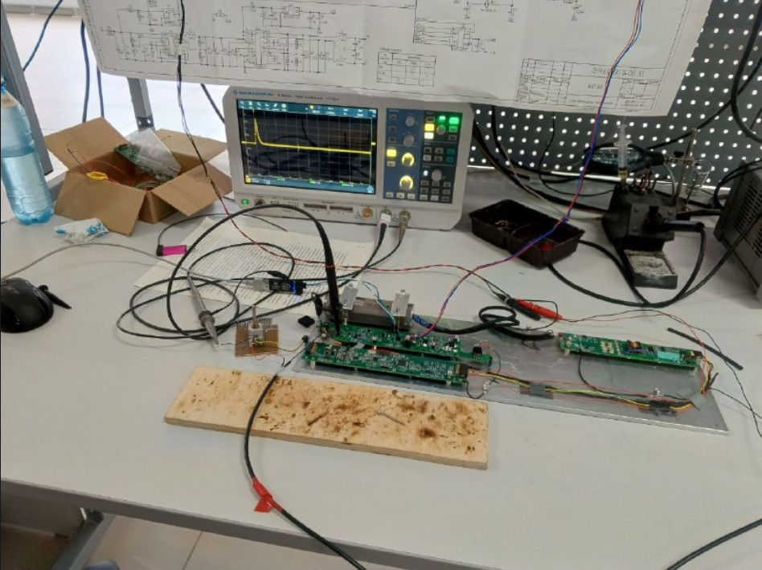

- ``` Разрабатываю прибор с технологией литологоплотностного гаммагамма каротажа нефтегазовых скважин ```
- ```Выставил на DAC проговое напряжение для компаратора 2 вольта, чтобы исключить лишний шум ```
- ```Принимаю на внутренний ADC показания  гамма-излучения и перевожу аналоговый сигнал в цифровой для наполнения массива данных в течении 10 секунд```
- ```Считываю данные в момент срабатывания EXTI1, которое отрабатывает, когда импульс идет больше 2 вольт и компаратор выдает логическую единицу ```
- ```После считывания данных разряжаю кондесатор с пикового детектора для получения новых актуальных данных ```
- ```Частота таймера 80MHz, установил на таймере делитель 65535 и период 12204, что примерно равно по расчетам 10 секундам ```

## P.S. на данный момент считывания данных происходит долго и большинство данных за время указанное таймеру теряется, необходимо в следующей версии прошивки ускорить процесс записи