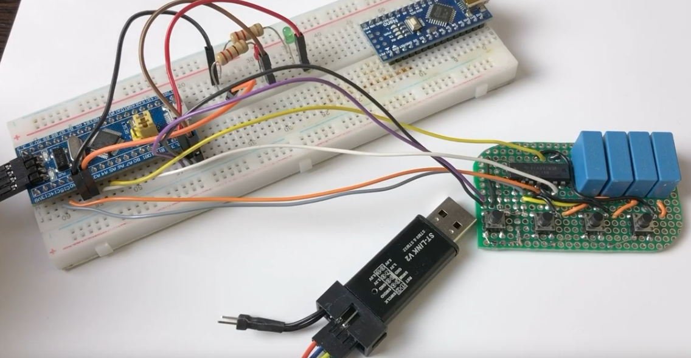
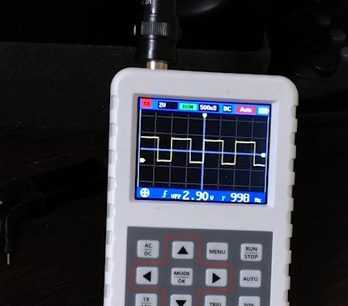

## Проект Blink_001

Обычное моргание светодиодом, задержка времени реализована через HAL_tick
> Макетная плата STM32F103C8T6
```
while (1) {
		/* USER CODE END WHILE */

		/* USER CODE BEGIN 3 */
		//LED_GPIO_Port = GPIOC;
		//LED_Pin = GPIO_PIN_13
		if (flag == 1) {
			if (HAL_GetTick() - T >= 2000) {
				flag = 0;
				T = HAL_GetTick();
			}
		}
		if (flag == 0) {
			if (HAL_GetTick() - T >= 2000) {
				flag = 1;
				T = HAL_GetTick();
			}
		}
		/* OR
		if(flag) {
			GPIOC->BSRR = (uint32_t) LED_Pin << 16u;
		} else {
			GPIOC->BSRR = LED_Pin;
		}
		*/
		HAL_GPIO_WritePin(GPIOC,  LED_Pin, flag);
	}
```


## Проект Blink_Button_002

Реализована моргание светодиодом за счет нажатия на кнопки BT_1 и BT_2
> Макетная плата STM32F103C8T6

```
void Button_1() {
	if ((GPIOC->IDR & BUTTON_1_Pin) && !flag_block_1) {
		flag_block_1 = 1;
		flag_set_1 = !flag_set_1;
		if (flag_set_1) {
			GPIOA->BSRR = RED_Pin;
		} else if (!flag_set_1) {
			GPIOA->BRR = RED_Pin;
		}
	} else if (!(GPIOC->IDR & BUTTON_1_Pin) && flag_block_1) {
		flag_block_1 = 0;
	}
}

void Button_2() {
	if ((GPIOC->IDR & BUTTON_2_Pin) && !flag_block_1) {
		flag_block_2 = 1;
		flag_set_2 = !flag_set_2;
		if (flag_set_1) {
			GPIOA->BSRR = GREEN_Pin;
		} else if (!flag_set_2) {
			GPIOA->BRR = GREEN_Pin;
		}
	} else if (!(GPIOC->IDR & BUTTON_2_Pin) && flag_block_2) {
		flag_block_2 = 0;
	}
}
```

## Проект Blink_PWM 

В данном проекте настроен ШИП таймера 2 на двух каналах
> Макетная плата STM32F103C8T6
```
if (HAL_GetTick() - T >= 1) {
			T = HAL_GetTick();
			if (flag) {
				TIM2->CCR2 = i;
				TIM2->CCR3 = My_Period - i;
				i++;
				i = (i == My_Period) ? 0 : i;
				flag = (i == My_Period) ? 0 : 1;
			} else {
				TIM2->CCR3 = i;
				TIM2->CCR2 = My_Period - i;
				i++;
				i = (i == My_Period) ? 0 : i;
				flag = (i == My_Period) ? 1 : 0;
			}
		}
```
